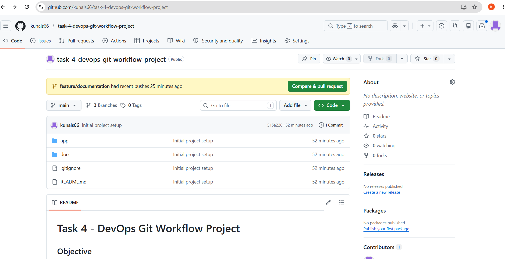
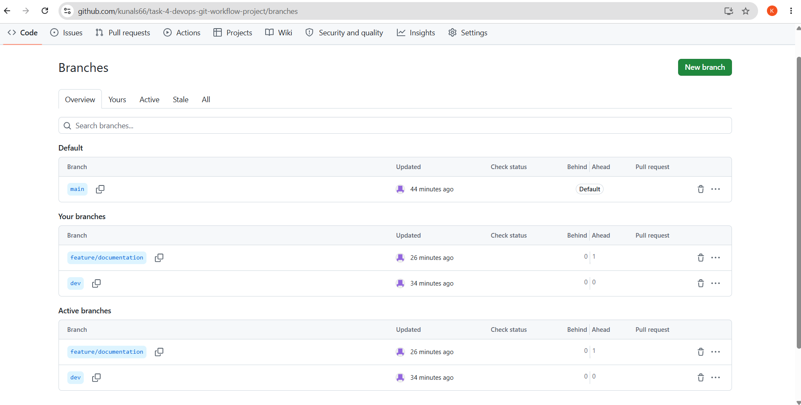
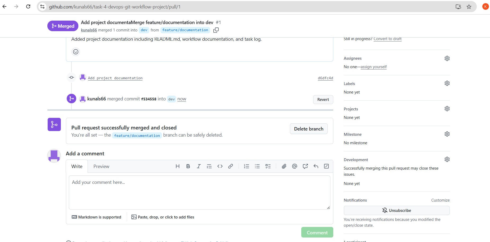
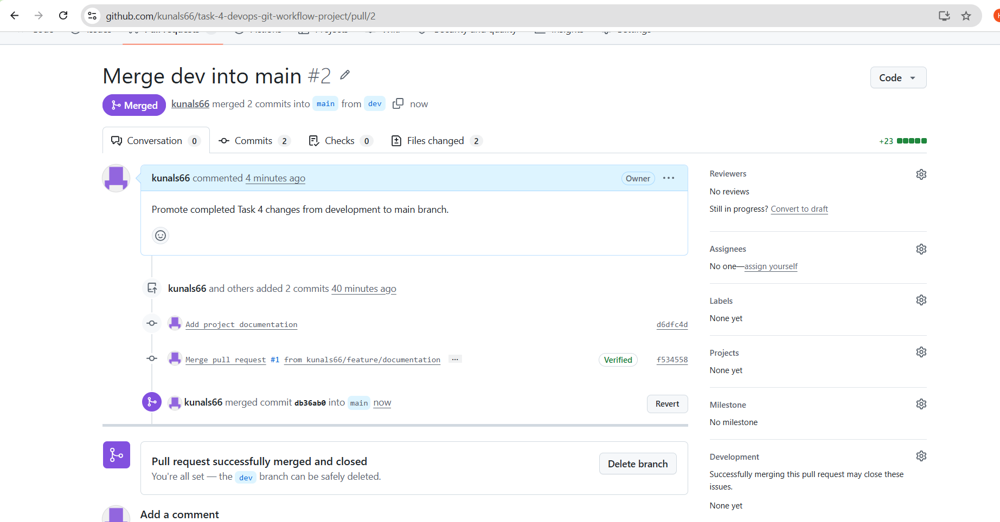
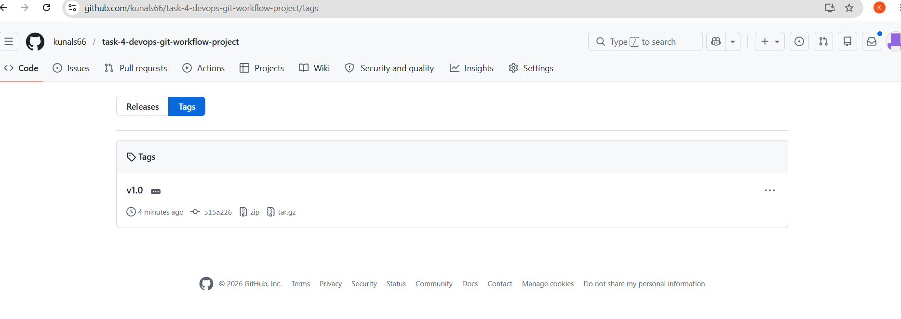

# Task 4 - Build a Version-Controlled DevOps Project with Git

## Objective

Manage a DevOps project using Git and GitHub best practices including branching, pull requests, tags, and documentation.

## Tools Used

* Git
* GitHub
* Visual Studio Code

## Repository Name

task-4-devops-git-workflow-project

## Branching Strategy

* main
* dev
* feature/documentation

## Tasks Completed

* Initialized Git repository
* Connected local repository to GitHub
* Created main branch
* Created dev branch
* Created feature/documentation branch
* Added README.md and .gitignore
* Created Pull Requests
* Merged feature branch into dev
* Merged dev into main
* Created and pushed Git tag v1.0

## Git Workflow

```text
feature/documentation
          ↓
         dev
          ↓
        main
```

## Screenshots

### Repository Home



### Branches



### Pull Request: feature/documentation → dev



### Pull Request: dev → main



### Version Tag v1.0



## Learning Outcome

Through this project, I learned:

* Git version control fundamentals
* Branch management
* Pull request workflow
* Merge operations
* Git tagging
* Repository documentation
* GitHub collaboration workflow

## Author

Kunal Suryawanshi
